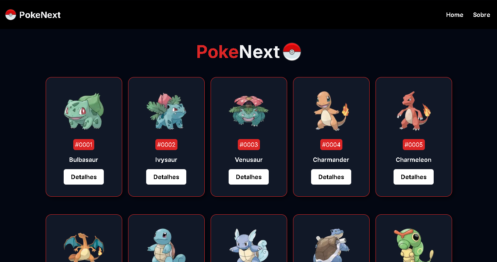

<h1 align="center">
    
    PokeNext
</h1>

  <a href="#ferramentas">Ferramentas</a> |
  <a href="#projetos">Projetos</a> |
  <a href="#aprendizado">Aprendizado</a> |
  <a href="#licença">Licença</a>

  

 

## 🧰 Ferramentas

Para criar o projeto fora usado as ferramentas abaixo com foco em testar habilidades com uma aplicação:

- React + NextJs
- TypeScript
- styled-components

## 💻 Projeto

O principal motivo de criação do projeto foi a aplicação dos meus novo conhecimentos em nextjs e styled-components, e por ser a aplicação usada como base para explicar o funcionamento do nextjs no 🔗[Curso de NextJS](https://www.youtube.com/playlist?list=PLnDvRpP8BnezfJcfiClWskFOLODeqI_Ft) do canal do YouTube 🔗[Matheus Battisti - Hora de Codar](http://www.youtube.com/@MatheusBattisti).

O Projeto e uma pokedex tradicional conectada a uma api externa, apresentando informações de cada mostro ao acessar os detalhes de cada.

A api gratis usado foi a 🔗[pokeapi](https://pokeapi.co).

Acesse o site 🔗[PokeNext](https://poke-next-two-phi.vercel.app/).

## 📖 Aprendizado

Durante o desenvolvimento do projeto tive como praticar 

- A criação de uma aplicação usando o nextjs.
- Criar rotas usando app router do next 14.
- Criar rotas dinâmicas.
- Criar um cachear rotas para otimizar o acesso do usuário ao site.
- Implementar styled-components ao nextjs.

## 📃 Licença

Fora usado a licença ( 🔗[MIT](./LICENSE.txt) ) no projeto.